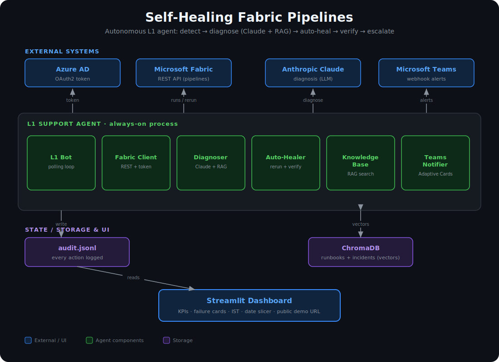
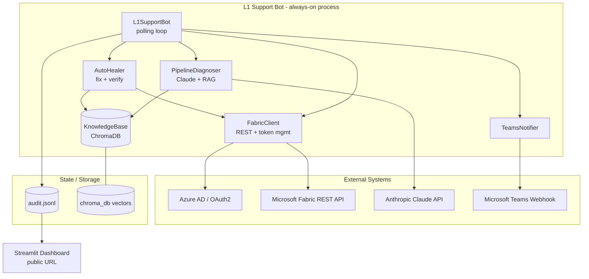
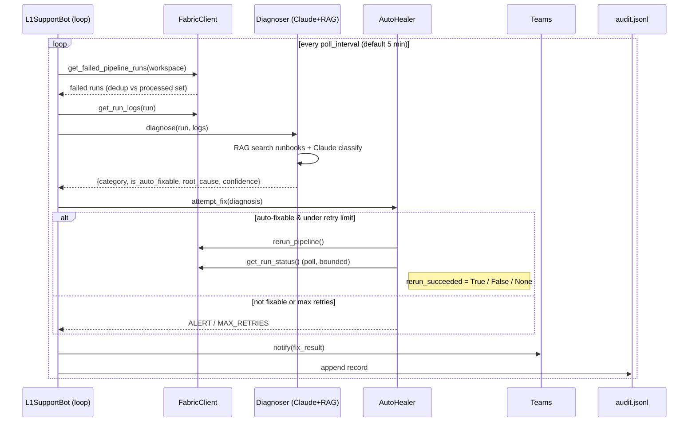
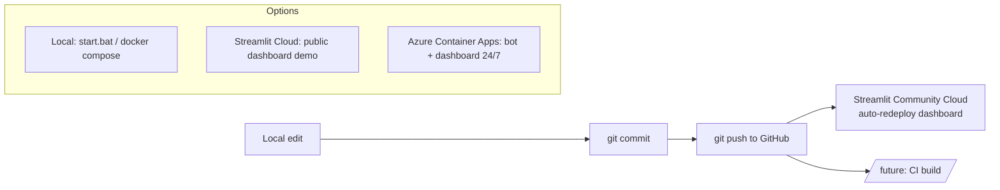

# Architecture — Self-Healing Fabric Pipelines

End-to-end architecture of this repository: an autonomous **L1 support agent** for
Microsoft Fabric data pipelines that detects failures, diagnoses them with Claude +
a RAG knowledge base, **auto-heals** transient failures (and *verifies* the fix),
escalates the rest, and surfaces everything on a live Streamlit dashboard.

<p align="center">
  
</p>

---

## 1. Repository layout (two independent projects)

```
fabric-pipeline-agent/
├── fabric_l1_support/        # PROJECT 1 — the L1 support bot + dashboard (hosted service)
│   ├── main.py               # entry point: wires components, runs the polling loop
│   ├── config/settings.py    # env-driven configuration
│   ├── src/
│   │   ├── agent/            # l1_bot (orchestrator), diagnoser (Claude+RAG), auto_healer
│   │   ├── api/              # fabric_client (Fabric REST + AAD auth)
│   │   ├── rag/              # knowledge_base (ChromaDB vector store)
│   │   ├── notifications/    # teams_notifier (Adaptive Cards)
│   │   └── models/           # schemas (dataclasses + enums)
│   ├── runbooks/             # knowledge content (error patterns + troubleshooting)
│   ├── dashboard/            # Streamlit dashboard + sample-data generator
│   ├── Dockerfile / docker-compose.yml / entrypoint.sh
│   └── DEPLOY.md / dashboard/STREAMLIT_CLOUD.md
│
└── migration/                # PROJECT 2 — one-time Fabric setup scripts (NOT a hosted service)
    ├── config/settings.py
    └── scripts/              # create_lakehouse, deploy_medallion, deploy_migration_pipeline, organize_workspace
```

The two projects are fully independent (each has its own `config/` and `.env`).
This document focuses on **Project 1**, the bot.

---

## 2. High-level architecture



---

## 3. Runtime flow — life of a failed pipeline



**Decision logic (`AutoHealer`):**
- `retries ≥ 3` → **MAX_RETRIES** (escalate to L2)
- not `is_auto_fixable` → **ALERT_SENT** (human needed)
- else → **AUTO_RERUN**: trigger rerun, then **poll its status** (up to ~2 min) to set
  `rerun_succeeded` = `True` (recovered) / `False` (failed again) / `None` (still running)

---

## 4. Components

| Component | File | Responsibility |
|-----------|------|----------------|
| Entry point | `main.py` | Load `.env`, configure logging, wire components, start the loop |
| Orchestrator | `src/agent/l1_bot.py` | Polling loop, dedup, bounded concurrency (5), audit logging |
| Diagnoser | `src/agent/diagnoser.py` | RAG context + Claude classification → `DiagnosisResult` |
| Auto-Healer | `src/agent/auto_healer.py` | Fix-or-escalate, max-3 retries, rerun + **verify outcome** |
| Fabric client | `src/api/fabric_client.py` | AAD token (cached), list runs, get logs, rerun, get status; `tenacity` retries |
| Knowledge base | `src/rag/knowledge_base.py` | ChromaDB vectors; index runbooks; semantic search; store resolved incidents |
| Teams notifier | `src/notifications/teams_notifier.py` | Adaptive Card alerts with Fabric deep-links |
| Data models | `src/models/schemas.py` | `PipelineRun`, `DiagnosisResult`, `FixResult` + enums |
| Config | `config/settings.py` | Env-driven settings |
| Dashboard | `dashboard/app.py` | Streamlit UI; reads audit log; live Fabric pipeline count; IST times; date slicer; demo fallback |

---

## 5. Data models

```
PipelineRun ──► DiagnosisResult ──► FixResult ──► audit.jsonl ──► Dashboard

ErrorCategory : transient | auth | infra        → auto-fixable
                schema | permission | data_quality | source_missing | unknown → human
ActionTaken   : auto_rerun | alert_sent | max_retries_exceeded | investigating
FixResult.rerun_succeeded : True (recovered) | False (failed again) | None (unverified)
```

---

## 6. Knowledge base (RAG)

- **Store:** ChromaDB (embedded, persistent) with cosine similarity.
- **Indexed content:** `runbooks/*.md` (troubleshooting) + `runbooks/*.json` (error patterns).
- **Self-learning:** every auto-fix writes a "resolved incident" back into the store,
  improving future diagnoses.
- **Used by:** the diagnoser retrieves the top-N similar past errors/runbook entries and
  passes them to Claude as context.

---

## 7. External integrations

| System | Purpose | Auth |
|--------|---------|------|
| Azure AD | Bearer token for Fabric | OAuth2 client-credentials (service principal) |
| Microsoft Fabric REST API | List pipelines/runs, logs, rerun, status | Bearer token |
| Anthropic Claude API | Root-cause diagnosis | API key; `claude-opus-4-8`, prompt caching, adaptive thinking |
| Microsoft Teams | Alerts | Incoming webhook (optional — logs only if unset) |
| ChromaDB | RAG vector store | Local/embedded |

---

## 8. Dashboard

Streamlit app (`dashboard/app.py`) reading `audit.jsonl`:
- **KPIs:** Total Pipelines (live Fabric count), Failed, Auto-Fixed (reruns triggered),
  **Recovered** (reruns *verified* successful), Escalated, Max Retries Hit.
- **Failure cards:** error message + root cause + category/action badges, timestamps in **IST**.
- **Date slicer:** "Last N days" range or a specific date (IST-aware).
- **Demo fallback:** if no audit log exists (e.g. public hosting), it generates realistic
  sample data and shows a "Live demo" banner — so it never appears empty and never needs secrets.

---

## 9. Deployment & hosting



| Target | What runs | Data | Notes |
|--------|-----------|------|-------|
| **Local** (`start.bat` / `docker compose`) | Bot + dashboard | **Real** (your `.env` + audit log) | Full functionality |
| **Streamlit Community Cloud** | Dashboard only | **Demo** (sample fallback) | Free public URL for showcase; no secrets |
| **Azure Container Apps** | Bot + dashboard | Real (with shared storage) | Production 24/7; secrets via Key Vault |

- **Container:** one image (`Dockerfile`) runs as bot or dashboard via `APP_ROLE`
  (`entrypoint.sh`); `docker-compose.yml` runs both with shared volumes.
- **Auto-deploy:** Streamlit Cloud redeploys on every `git push` to `master`.

---

## 10. Configuration (`.env`)

`AZURE_TENANT_ID`, `AZURE_CLIENT_ID`, `AZURE_CLIENT_SECRET`, `ANTHROPIC_API_KEY`,
`TEAMS_WEBHOOK_URL`, `FABRIC_WORKSPACE_IDS`, `POLL_INTERVAL_SECONDS`,
`CHROMA_DB_PATH`, `RUNBOOKS_DIR`, `AUDIT_LOG_PATH`.

Secrets are git-ignored; only `.env.example` (placeholders) is committed.

---

## 11. Tech stack

Python 3.12+ · `asyncio` · `httpx` · `tenacity` · `anthropic` · `chromadb` ·
`streamlit` + `plotly` + `pandas` · `python-dotenv` · Docker.

---

## 12. Known gaps / roadmap

- **In-memory state:** `processed_runs` and retry counts reset on restart → move to a database.
- **Lookback filter unused:** `get_failed_pipeline_runs(lookback_minutes)` is not applied.
- **Unknown status defaults to FAILED** in run parsing — could cause false positives.
- **No confidence gate** before auto-fix; **no global kill-switch**.
- **Backoff defined but not applied** between retries.
- **Verification is time-bounded** (~2 min); longer pipelines show `rerun_succeeded = None`.
- **Next steps:** persistent state (Postgres), Key Vault secrets, GitHub Actions CI/CD,
  shared storage so the cloud dashboard reflects real bot activity.
