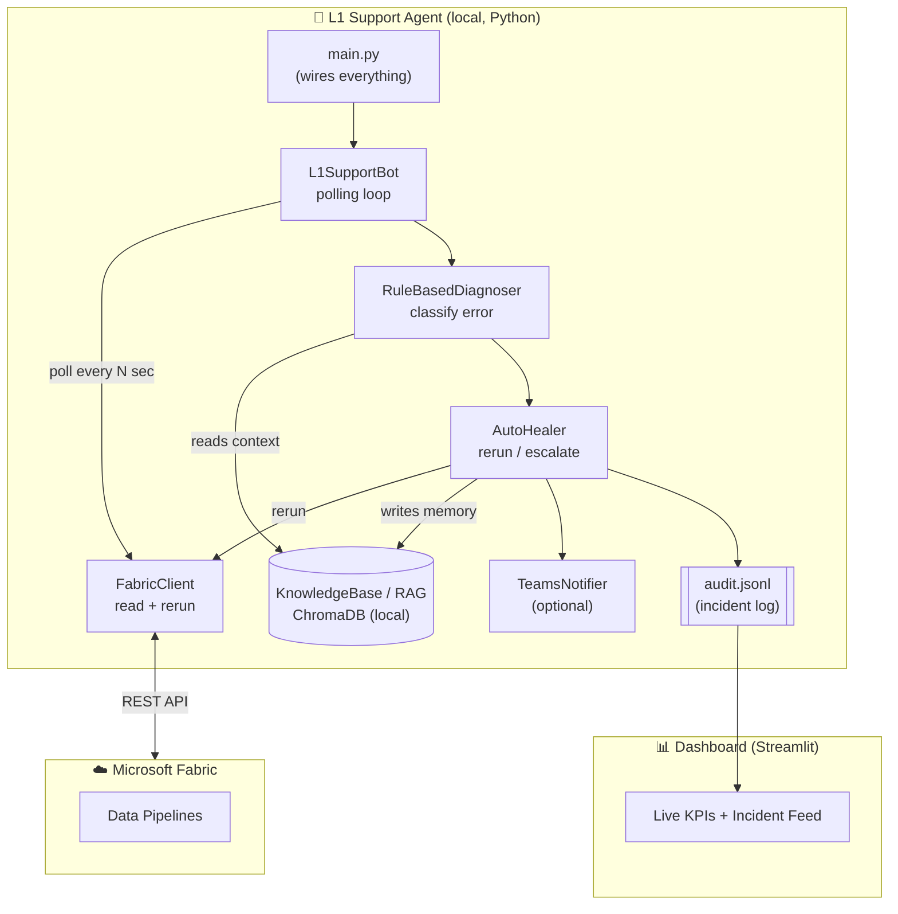
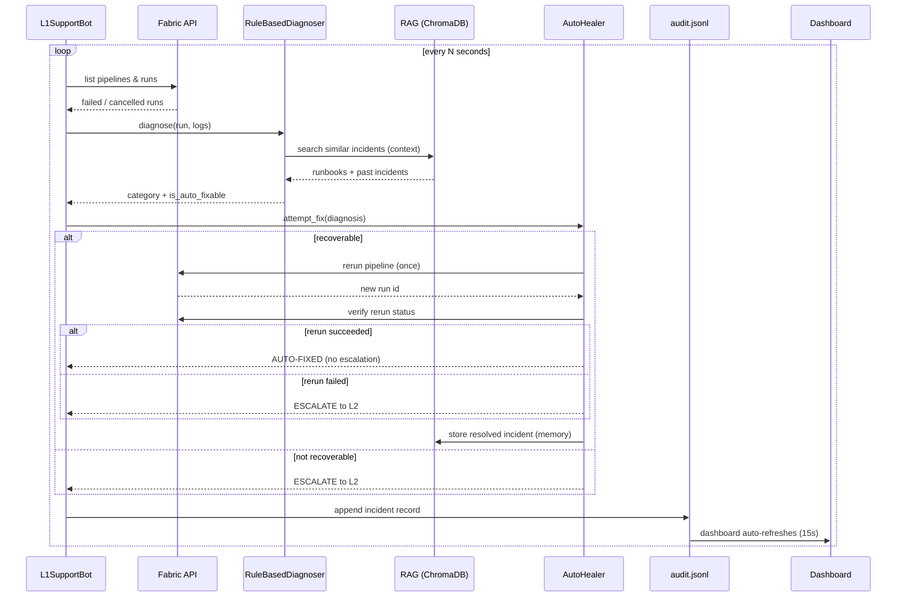
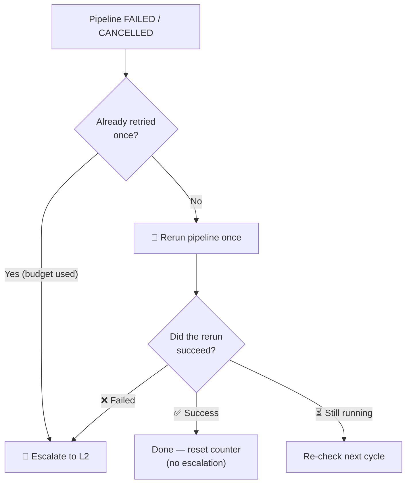
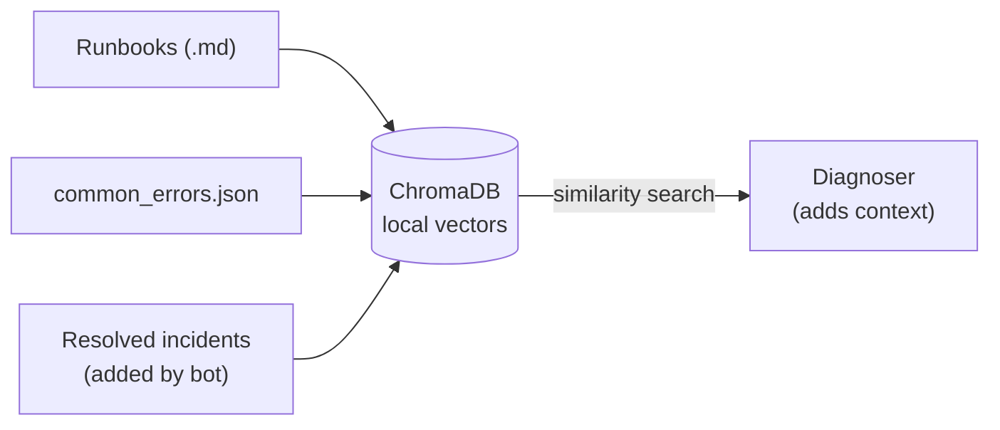

# 🤖 Self-Healing Microsoft Fabric Pipelines — L1 Support Agent

> An autonomous agent that monitors Microsoft Fabric data pipelines 24/7, automatically
> recovers failed/cancelled runs, and escalates only the genuinely broken ones to L2 —
> running **fully local with no LLM API cost**.

---

## 📑 Table of Contents
1. [Overview](#1-overview)
2. [Problem & Solution](#2-problem--solution)
3. [High-Level Architecture](#3-high-level-architecture)
4. [Technical Stack](#4-technical-stack)
5. [Component Breakdown](#5-component-breakdown)
6. [End-to-End Flow](#6-end-to-end-flow)
7. [Rerun Logic](#7-rerun-logic)
8. [Error Classification](#8-error-classification)
9. [RAG Knowledge Base](#9-rag-knowledge-base)
10. [Dashboard](#10-dashboard)
11. [Data Storage](#11-data-storage)
12. [Configuration](#12-configuration)
13. [Folder Structure](#13-folder-structure)
14. [How to Run](#14-how-to-run)
15. [Business Value](#15-business-value)

---

## 1. Overview

The **L1 Support Agent** is an automated "self-healing" layer for Microsoft Fabric data
pipelines. It continuously watches a Fabric workspace, detects failed or cancelled pipeline
runs, decides what to do using a rule engine, automatically reruns recoverable failures, and
escalates the rest to a human (L2) — while logging everything to a live dashboard.

| | |
|---|---|
| **Mode** | Local / no-credit (rule-based, no Azure OpenAI / Claude key) |
| **Runs on** | A single machine (Python) |
| **External dependency** | Microsoft Fabric REST API (read + rerun pipelines) |
| **Cost** | No LLM API cost — rule engine + local embeddings |

---

## 2. Problem & Solution

**Problem:** Data pipelines fail from transient issues (timeouts, throttling, network/gateway
blips, cancellations). Today an engineer must *notice* the failure, *diagnose* it, and
*manually rerun* it — slow, after-hours, and repetitive.

**Solution:** The agent automates the entire L1 loop:

```
Monitor → Detect → Diagnose → Rerun (once) → Escalate if still failing → Log
```

Humans only get involved for pipelines that are **genuinely broken** (fail even after a rerun).

---

## 3. High-Level Architecture



**Critical path (required):** `Poll → Diagnose → Rerun/Escalate → Audit → Dashboard`
**Side-loop (bonus):** RAG reads context + writes memory.

---

## 4. Technical Stack

| Layer | Technology | Purpose |
|-------|-----------|---------|
| **Language** | Python 3.11+ | Core runtime |
| **Async HTTP** | `httpx` | Calls to Fabric REST API |
| **Retries** | `tenacity` | Resilient API calls (exponential backoff) |
| **Vector DB / RAG** | `chromadb` (local SQLite) | Knowledge base of runbooks + past incidents |
| **Embeddings** | ChromaDB default (`all-MiniLM-L6-v2`, local) | Local text→vector, **no API key** |
| **Config** | `python-dotenv` | Loads `.env` credentials & settings |
| **Dashboard** | `streamlit` + `streamlit-autorefresh` | Live web UI (auto-refresh 15s) |
| **Charts** | `plotly` | Trend analysis / visualizations |
| **Data** | `pandas` | In-memory filtering of the audit log |
| **Cloud API** | Microsoft Fabric REST API | List items, read runs, trigger reruns |
| **Auth** | Azure AD (service principal, client credentials) | Token for Fabric API |

> The `openai` package is listed but **not used** in the local build (the rule-based
> diagnoser replaces the LLM). It only remains so the optional Azure version still imports.

---

## 5. Component Breakdown

| Component | File | Responsibility |
|-----------|------|----------------|
| **Entry point** | `main.py` | Loads config, wires all components, starts the bot |
| **Settings** | `config/settings_local.py` | Reads `.env` (Fabric creds, workspace, intervals) — no LLM keys |
| **Orchestrator** | `src/agent/l1_bot.py` | Polling loop; dedup; cutoff window; writes audit log |
| **Diagnoser** | `src/agent/rule_based_diagnoser.py` | Classifies the error via regex rules + RAG context |
| **Auto-healer** | `src/agent/auto_healer.py` | Decides: rerun (once) → escalate to L2; backoff; team routing |
| **Fabric client** | `src/api/fabric_client.py` | AAD auth + Fabric REST calls (list, runs, rerun, status) |
| **Knowledge base** | `src/rag/knowledge_base.py` | ChromaDB store; index runbooks; add/search incidents |
| **Notifier** | `src/notifications/teams_notifier.py` | Optional Teams Adaptive Card alerts |
| **Models** | `src/models/schemas.py` | Dataclasses + enums (PipelineRun, DiagnosisResult, etc.) |
| **Dashboard** | `dashboard/app.py` | Streamlit UI reading `logs/audit.jsonl` |
| **Runbooks** | `runbooks/common_errors.json` | The error-pattern rule table |

---

## 6. End-to-End Flow



---

## 7. Rerun Logic

> **The rule:** Any pipeline fails → **rerun once** → if the rerun **succeeds**, done
> (no escalation); if it **fails**, **escalate to L2**.



### Retry budget (uniform)

| Error category | Reruns allowed | Then |
|----------------|:--------------:|------|
| transient, infra, auth, unknown, schema, permission, source_missing, data_quality | **1** | Escalate to L2 |

### Counter reset
- ✅ A rerun **succeeds** → counter resets to 0 (fresh budget next time)
- 🔄 Bot **restarts** → counter resets (held in memory)

### Safety features
- **Duplicate guard** — never reruns while a run is already in progress / already succeeded
- **Incident dedup** — one incident per pipeline per cycle
- **Rolling window** — only acts on failures within the last *N* minutes (default 60)
- **Verification** — polls the rerun's real outcome before deciding success/fail

---

## 8. Error Classification

The diagnoser matches the failure's error text against regex patterns in
`runbooks/common_errors.json`. Each match yields a **category** (shown on the dashboard):

| Category | Example trigger | Auto-fixable? |
|----------|-----------------|:-------------:|
| `transient` | OperationTimeout, 429, network blip | ✅ |
| `infra` | 503, on-premises gateway, connection refused | ✅ |
| `auth` | 401, TokenExpired | ✅ |
| `schema` | ColumnNotFound, TypeMismatch | ⚠️ |
| `permission` | 403, AccessDenied | ⚠️ |
| `source_missing` | FileNotFound, 404, TableNotFound | ⚠️ |
| `data_quality` | DuplicateKey, NullConstraint | ⚠️ |
| `unknown` | no pattern matched | ❓ |

> Under the current uniform policy, **every** category gets one rerun before escalating.
> The category is still used for **dashboard labels** and **team routing**
> (source-side → Data Platform team; others → L2).

---

## 9. RAG Knowledge Base

RAG (Retrieval-Augmented Generation) here is a **local, self-learning memory** — a bonus
layer, not on the critical path.



- **Retrieval (R)** — runs locally (embeddings via `all-MiniLM-L6-v2`), **no API key**
- **Stores 3 kinds of docs** — runbooks, error patterns, and bot-resolved incidents
- **Grows over time** — every handled incident is saved as searchable memory
- **Future-ready** — if an LLM diagnoser is ever re-enabled, it consumes this context to
  reason about *novel* errors

---

## 10. Dashboard

A **Streamlit** web app (`dashboard/app.py`) that reads `logs/audit.jsonl` and
**auto-refreshes every 15 seconds**.

> 📷 **Screenshots:** drop your dashboard captures into a `docs/images/` folder and reference
> them here, e.g. ``.

### KPI cards

| KPI | Meaning | Date-filtered? |
|-----|---------|:--------------:|
| **Total Pipelines** | Live count of pipelines in the workspace | 🔵 Live (current) |
| **Successful Pipelines** | Total − pipelines with failures | ✅ |
| **Failed Pipelines** | Incidents in the period | ✅ |
| **Auto-Fixed** | Reruns triggered | ✅ |
| **Recovered** | Reruns verified to succeed | ✅ |
| **Escalated to L2** | Handed off to a human (retries exhausted / alert) | ✅ |
| **Max Retries Hit** | Reached the retry cap | ✅ |

### Incident feed
Each failure shows a card with: pipeline name, **category** badge, **action** (AUTO-FIXED /
ESCALATED), run status, retry count, confidence, the **error message**, and root cause.

### Filters
- **Date range** — Last 1 / 7 / 14 / 30 days
- **Specific date** — any single day in the history
- Both modes drive **all** KPIs and the feed.

### Trend analysis
Plotly charts: incidents over time + category breakdown (donut).

---

## 11. Data Storage

> Everything is **100% local** — no cloud database. The only cloud calls are to *your* Fabric API.

| Data | Location | Format |
|------|----------|--------|
| **Incident / dashboard data** | `logs/audit.jsonl` | JSON Lines (append-only, kept forever) |
| **Knowledge base (RAG)** | `data/chroma_db/` | ChromaDB (SQLite + vector index) |
| **Runtime log** | `logs/bot.log` | Text (auto-rotates at 10 MB) |
| **Config / credentials** | `.env` | Key=value |

- Audit records ≈ 300–500 bytes each (~18 MB/year at 100 incidents/day).
- Dashboard date dropdown shows up to **30 days**; **Specific date** reaches any stored day.

---

## 12. Configuration

`.env` (local build — no LLM keys):

```ini
# Microsoft Fabric auth (required)
AZURE_TENANT_ID=...
AZURE_CLIENT_ID=...
AZURE_CLIENT_SECRET=...

# Workspace + behaviour
FABRIC_WORKSPACE_IDS=...
POLL_INTERVAL_SECONDS=120
LOOKBACK_MINUTES=60

# Storage
CHROMA_DB_PATH=./data/chroma_db
RUNBOOKS_DIR=./runbooks
AUDIT_LOG_PATH=./logs/audit.jsonl

# Optional
# TEAMS_WEBHOOK_URL=
# GATEWAY_CHECK_ENABLED=false
```

---

## 13. Folder Structure

```
local/
├── main.py                         # entry point (rule-based, no key)
├── .env                            # Fabric creds + settings
├── requirements.txt
├── config/
│   └── settings_local.py           # LocalSettings (no LLM keys)
├── src/
│   ├── agent/
│   │   ├── l1_bot.py               # polling loop / orchestrator
│   │   ├── rule_based_diagnoser.py # regex classification + RAG context
│   │   └── auto_healer.py          # rerun-once → escalate logic
│   ├── api/
│   │   └── fabric_client.py        # Fabric REST + AAD auth
│   ├── rag/
│   │   └── knowledge_base.py       # ChromaDB knowledge base
│   ├── notifications/
│   │   └── teams_notifier.py       # optional Teams alerts
│   └── models/
│       └── schemas.py              # dataclasses + enums
├── runbooks/
│   ├── common_errors.json          # the rule table
│   └── pipeline_troubleshooting.md
├── dashboard/
│   └── app.py                      # Streamlit dashboard
├── data/chroma_db/                 # RAG store (local)
└── logs/
    ├── audit.jsonl                 # incident log (dashboard source)
    └── bot.log                     # runtime log
```

---

## 14. How to Run

```bat
:: From the project folder
cd C:\FabricL1_Support\local

:: Install dependencies (first time)
pip install -r requirements.txt

:: Start the bot + dashboard together
start.bat
```

- Bot polls Fabric, handles failures, writes the audit log.
- Dashboard opens at **http://localhost:8503** (auto-refresh 15s).
- ⚠️ **Run only one bot instance** at a time (two bots double the reruns).

---

## 15. Business Value

| Manual L1 task (before) | With the agent | Effort removed |
|-------------------------|----------------|:--------------:|
| 24/7 watching for failures | Automatic polling | ~100% |
| Triage / diagnosis | Instant rule-based classification | ~80–90% |
| Rerunning transient failures | Auto-rerun | ~100% of transient |
| Escalation routing | Automatic, categorized | ~90% |
| Logging / documentation | Auto-written | ~100% |

> **Estimated 50–70% reduction in routine L1 effort** (depends on the transient-failure mix —
> measured live on the dashboard via **Recovered ÷ Total**).

---

*Generated documentation — Self-Healing Fabric Pipelines L1 Support Agent (local edition).*
